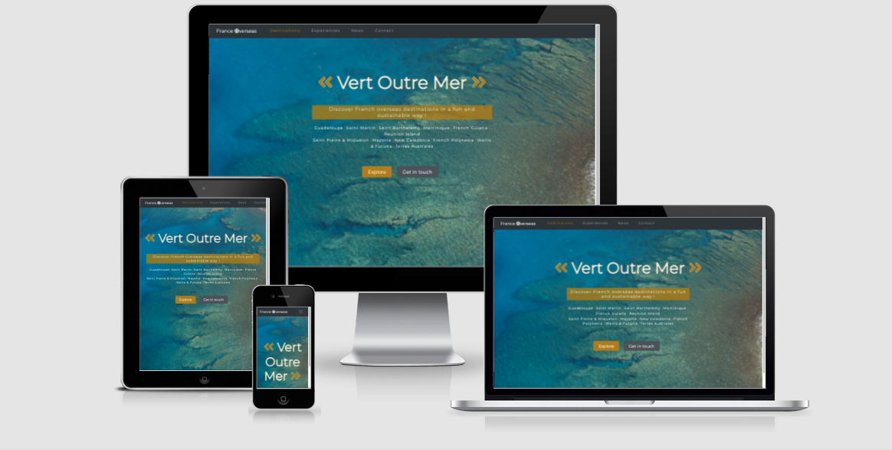

# Next holiday destination: France Overseas - Vert Outre Mer

[View the live project here](link)

## User Experience (UX)

### End user 

1. Goal
End users for this project are :
- travellers considering to visit French overseas destinations in a sustainable way for leisure purposes.
- tourism professionnals who want to promote their service and learn about sustainable practices for their activity

2.  Profiles 

a. Travellers

Travellers interacting with the site are French and English speaker and lives mainly in France (but it can be anywhere in the world). They are environmentally conscious and socially responsible. They are in favor of sustainable practices in the tourism industry. Below we can find more about their profile :

* Single, Couple or Family travellers
* English / French travellers
* Local visitors

b. Tourism professionnals 

Tourism professionnals aim to promote their activity and their practices. Making their business more sustainable is their primary goal as it will improve management in general.
Also new pratices will help to attract new customers.

### User stories

1. First Time Visitor Goals

* As a traveller, I want to have an overview of the French overseas destinations so that I can identify my destination options 
* As a traveller, I want to be have information about places to stay, restaurants and transport so that I can experience the destination in a authentic way.
* As a traveller, I want to see the upcoming events/experiences in a chosen destination so that I can organise my activities during my stay.
* As a traveller I want to be able to support local businesses who invest in sustainable practices so that I can help make the tourism industry evolve.
* As a traveller I want to easily contact an agency so that I can have more information / advice before travelling to the destination.
* As a tourism professionnal I would like to have more online visibility so that I can attract more clients with a green mindset to my business
* As a tourism professionnal I want to learn and stay informed about sustainable practices regurlarly so i can improve my business.
* As a tourism professionnal I would like to have information about how to get a « Vert Outre Mer » label so that I can better promote my business and sustainable practices

2. Returning Visitors Goals

* As a traveller, I want to see different French overseas destinations so that I can make up my mind regarding the destination to visit.
* As a tourism professionnal I would like to communicate more about my practices and would like « Vert Outre Mer » to offer to publish an article about my activity on their website every semester/trimester so that I can gain visibility and show my progress in terms of sustainable tourism. 
* As a tourism professionnal I want to be able to share articles written about my activity easily on social media so that I can attract new clients

3. Frequent User Goals

* As a local visitors I want to see if there are any new local events/experiences organized per month so that I can participate
* As a tourism professionnal, I want to be informed about sustainable news / practices so that I am aware of the latest sustainable trends and possibly apply them to my activity 

### Design

1. Colour Scheme
The main colours used for this project are as follow : 
* `#146A84`: blue-green color
* `darkgoldenyellow`: dark gold color
* `#545B62`: dark grey color
* ``: light grey color
* `#fafafa`: cream white

2. Typography
The `Montserrat` font is the main font used throughout the whole website with `sans-serif`
as fallback fonts in case for any reason the font isn't being imported into the site correctly. 

3. Imagery
Imagery is important in this website about sustainable tourism as it bring the travellers already within the destination. Images are mainly landscapes images.

* The large background of the main page [hero image](assets/css/images/hero_image.JPG) is designed to be striking and catch the user's attention. It also has a blue/green aesthetic. Blue is to reflect the fact that you have to cross the sea to get to these specific destinations and Green is to remind that it is focus on sustainable tourism

* Random web designs about topic "travel" were selected on a website called [Behance](ttps://www.behance.net) in order to illustrate website projects.

### Wireframes

1. All Wireframes - [View](assets/wireframes/all_wireframes_vert_loutre_mer.pdf)

2. Mobile Wireframes - [View](assets/wireframes/mobile_wireframes_vert_loutre_mer.pdf)

3. Tablet Wireframes - [View](assets/wireframes/web_wireframes_vert_loutre_mer.pdf)

4. Web Wireframes - [View](assets/wireframes/web_wireframes_vert_loutre_mer.pdf)

## Features

* The website is structured in 4 pages : `Destinations`, `Experiences`, `News`, `About`.
* The website's pages and different features are responsive on all device sizes. 
* Each page features a responsive header with navigation bar and a conventional placing of logo (top left).
* There is a footer with copyright information and social media links.

#### Destinations

* The `Destinations` page features a special hero image that cover the entire background of the first page. The purpose of this hero image element is to give maximum impact when opening the website.
* There is a main heading in which you can read "Vert Outre Mer". "Vers Outre Mer" means towards overseas and in order to include a notion of sustainable/green aspect I used the writing "Vert" which means green.
* The sub heading is short, impactful and invite any users to experience and learn about sustainibily in these destinations. 
* The destinations are presented lined up. The user will be redirected to tourism office website when they click on one destination. 
* At the bottom of the page (above the footer) there is two call to action :
    - `Explore`: This button is highlighted and redirect the user to the experiences page
    - `Get in touch` : This button redirects the user to the contact page.

#### Experiences

* The `Experiences` page features 1 column wide for mobile devices, 2 columns wide for tablets and 4 columns wide for desktop.
* The destinations list is displayed as dropdown. Users can select their destination by clicking one of the option.
* To see the experiences, users has access to a map view. Experiences are placed on the map with markers. Each marker display a description of the event. 
* For each destination selected a little description about the destination appears

#### News
* The `News` page features 1 column wide for mobile devices, 2 columns wide for tablets and 4 columns wide for desktop. 
* This page displays a list of news/ articles about sustainability in the tourism industry of these destinations. Users can share content on social media.
* User can subscribe to a newsletter thanks to a button "subscribe"

#### About

* The `About` page features 1 column wide for mobile devices, 2 columns wide for tablets and 4 columns wide for desktop. 
* Users can learn more about the activity and the purpose of the website thanks to a small description on the top of the page.
* Users can contact the website agency to request general information thanks to a contact form
    - examples of requets:
        + Travellers can request information about a specific event.
        + Travellers can provide feedback about the website content.
        + Tourism professionnals can request information green label eligibility
        + Tourism profesionnals can requet an article about their activity

* Users receives a confirmation email once the contact form is completed.

### Existing features 

1. On every page

* Header Logo - Clicking the logo returns users to the home page.
* Header Fixed Navigation Bar - Allows all users to easily navigate all the website's pages and find what they are looking for quickly.
In the mobile version the navigation bar is turning into a hamburger menu for a user friendly experience.
* Footer copyright info - Proof of brand and content protection is available on each page.
* Footer social media icons - Allows users to be redirected to social media platform to stay connected.

2. Page features specificities

* `Destinations`: Allows travellers to connect emotionnally with the sustainability aspect of the destinations. 
    - specificity 1 : interactivity / zoom on hero image, This feature is quite relevant as it translate the effect of mouvement that is link with travelling.
    - specificity 2 : lit of destinations with links that redirect to tourism office information of each destination

* `Experiences` : Allows travellers to identify events/experiences and activities in order ot organize their trip
    - specificity 1 : Give an overview of experiences related to sustainable tourism for each destination 
    - specificity 2 : Give more information about the destination thanks to a description

* `News` : Allows travellers and tourism professionnals to have an overview of the latest sustainable information in french overseas destinations. 
    - specificity 1 : Give an overview of the latest news in a chronological order. Latest information are in the top.
    - specificity 2 : Give th possibility to subscribe to a newsletter

* `About` : Allows users to get in touch with the agency
    - specificity : a contact form is implemented to allows travellers and tourism professionnals to contact the agency

### Features to implement in the future

* Add a listing of referenced companies with the "Vert Outre Mer" label in the News section. Each referenced partners will have a link to their website
* Add a feature that allows travellers and tourism professionnals to make a donation to support sustainable tourism
* Users can select the month and year to search for a event 
* User can switch to a list view for the experiences
* A paging feature will allow to navigate within the previous published article in the news secion
* Add Captcha on the contact form in the Contact page for security purposes.
* Translate website content in French option
* Be GDPR compliant by including a pop-up allowing all new visitors to the website to approve or deny the processing of their personal data. (relevant for the Contact page / contact form)

## Technologie Used 

### Languages Used

* [HTML5](https://en.wikipedia.org/wiki/HTML5)
* [CSS3](https://en.wikipedia.org/wiki/CSS)
* [JavaScript](https://en.wikipedia.org/wiki/JavaScript)

### Frameworks, Librairies & Programs Used

1. [Bootstrap 4.6](https://www.bootstrapcdn.com/)
Bootstrap was used to assist with the responsiveness and styling of the website.

2. [Hover.css](https://ianlunn.github.io/Hover/)
Hover.css was used on`social media icons for styling and give dynamim

3. [Google Fonts](https://fonts.google.com/)
Google fonts were used to import the `xxxxxx` font into the style.css file which is used on all pages throughout the project.

4. [Font Awesome](https://fontawesome.com/)
Font Awesome was used on all pages throughout the website to add icons for aesthetic purposes.

5. [Git](https://git-scm.com/)
Git was used for version control by utilizing the Gitpod terminal to commit to Git and Push to GitHub.

6. [GitHub](https://github.com/)
GitHub is used to store the projects code after being pushed from Git.

7. [Balsamiq](https://balsamiq.com/)
Balsamiq was used to create [the wireframes](All Wireframes.pdf) during the design process.

8. [Leaflet mapbox](https://leafletjs.com/examples/quick-start/)
 Leaflet, open-source JavaScript library for mobile-friendly interactive maps was used to illustrates were are located the experiences in each destination on a map.

9. [EmailJS](https://www.emailjs.com/)
EmailJs was used to allow users to send emails to  agency to request information.

## Testing 

Testing information can be found in the following file [View](testing.md))

## Deployment

### GitHub Pages
The project was deployed to GitHub Pages using the following steps :

1. Log in to GitHub and locate the GitHub Repository.
2. At the top of the Repository (not top of page), locate the "Settings" Button on the menu.
3. Scroll down the Settings page until you locate the "GitHub Pages" Section.
4. Under "Source", click the dropdown called "None" and select "Master Branch".
5. The page will automatically refresh.
6. Scroll back down through the page to locate the now published site link in the "GitHub Pages" section.

### Forking the GitHub Repository
By forking the GitHub Repository we make a copy of the original repository on our GitHub account to view and/or make changes without affecting the original repository by using the following steps...

1. Log in to GitHub and locate the GitHub Repository
2. At the top of the Repository (not top of page) just above the "Settings" Button on the menu, locate the "Fork" Button.
3. You should now have a copy of the original repository in your GitHub account.

### Making a Local Clone
1. Log in to GitHub and locate the GitHub Repository
2. Under the repository name, click "Clone or download".
3. To clone the repository using HTTPS, under "Clone with HTTPS", copy the link.
4. Open Git Bash
5. Change the current working directory to the location where you want the cloned directory to be made.
6. Type git clone, and then paste the URL you copied in Step 3.

> $ git clone https://github.com/YOUR-USERNAME/YOUR-REPOSITORY

7. Press Enter. Your local clone will be created.

> $ git clone https://github.com/YOUR-USERNAME/YOUR-REPOSITORY

> Cloning into `vert_l'outre_mer_clone`...
> remote: Counting objects: 10, done.
> remote: Compressing objects: 100% (8/8), done.
> remove: Total 10 (delta 1), reused 10 (delta 1)
> Unpacking objects: 100% (10/10), done.

All content for illustrations (pictures, icons, photos) can  be found within the assests repositery.

## Credits

### Code

1. Destinations page
* Code pen background image zoom [View] (https://codepen.io/andreaswik/pen/BgqQMG)
* Background for text [View](https://stackoverflow.com/questions/14310154/how-do-i-set-a-background-color-for-the-width-of-text-not-the-width-of-the-enti)

2. Experiences page
* Code Institute rosie's resume project : Interactive Front end Development [Here](https://github.com/Code-Institute-Solutions/InteractiveFrontendDevelopment-Resume)
* Leaflet mapbox youtube quick start documentation [View](https://leafletjs.com/examples/quick-start/)
* Leaflet mapbox Youtube tutorial / set the map [View](https://youtu.be/-E69eEvP4PI)
* Eventbrite api : [View](https://www.eventbrite.com/platform/api#/introduction/expansions/requesting-expansions)
* Opendata soft / documentation about french destinations i.e :coordinates  https://documentation-resources.opendatasoft.com/explore/dataset/regions-et-collectivites-doutre-mer-france/api/?disjunctive.reg_name
* dropdown selection :[View](https://stackoverflow.com/questions/13437446/how-to-display-selected-item-in-bootstrap-button-dropdown-title)

3. News page
* Newsletter pop up modal [View](https://bootstrap-top-design.com/creer-un-popup-bootstrap/)
* Code pen background image zoom [View] (https://codepen.io/andreaswik/pen/BgqQMG)

4. Contact page
* EmailJS contact form: [View](https://www.emailjs.com/docs/tutorial/creating-contact-form/)

### Content 

* All content was written by the developer.
* Psychological properties of colours was found [Here](http://www.colour-affects.co.uk/psychological-properties-of-colours)
* Psychological properties of fonts was found [Here](https://designmodo.com/font-psychology/)

* Readme.md inspiration models : 
Readme.md sample from Code Institute [View](https://github.com/Code-Institute-Solutions/SampleREADME)
Readme.md sample from Anna Greaves's portrait artist [View](https://github.com/AJGreaves/portrait-artist/blob/master/README.md)

* CSS tricks to amend Bootstrap [View](https://css-tricks.com/snippets/css/a-guide-to-flexbox/#flexbox-background)

* Behance for design inspirations [View](https://www.behance.net/)

* Gps coordinates site [View](https://www.gps-coordinates.net/)

### Media

* All photos and images were edited by the developer. 

### Acknowledgements

- My Mentor [Jack Washira](https://github.com/iamjackwachira) for continuous helpful feedback.

- Tutor support at Code Institute for their support.

- Peer to peer support from Code Institute Slack community.

## FAQ

#### Question 1 : Which framework has been used to develop this portfolio site project ?

* Bootstrap version 5.1 has been used to make this website nice and responsive on all devices and browsers.

#### Question 2 : Which Api's have been used for this project ?

* Leaflet, an open-source JavaScript library for mobile-friendly interactive maps has been use to retrieve the map

## Author 

- Florence Mezino, studying Full Stack Software Development at Code Institute (March 2021 - March 2022)

[Github](https://github.com/florencemezino)

## Feedback

If you have any feedback, please reach out to the developper of the this project Florence Mezino at florence.mezino@outlook.com
Thank you!